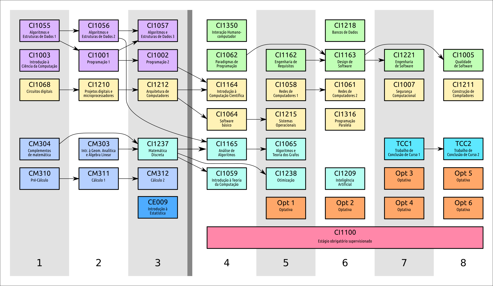

# Computer Science Freshmen at UFPR​ 🏛️​

### 🚨​ Attention: In this repository, I will write only in PORTUGUESE, as it is focused on the Computer Science freshmen at Federal University of Paraná(UFPR).

---

## ✨​💻​✨​Objetivo:
Esse projeto tem como objetivo ajudar os calouros do curso de Ciência da Computação da Universidade Federal do Paraná (UFPR) a se adequarem mais às matérias que serão
dadas. Com isso, nesse repositório, terão conteúdos, materiais e quaisquer outras informações que podem ajudar vocês, calouros, a ter uma vidinha mais fácil em uma das 10
melhores universidades do Brasil 🇧🇷​!!!. 

❗​IMPORTANTE: Esse repositório pode ser modificado ao longo do tempo, caso haja algum veterano que queira mandar informações e dicas extras a respeito das matérias ministradas
no primeiro período de graduação de BCC.

## ​⏰​​🗓️​Grade Curricular:
Essa é a grade curricular do nosso curso. Nesse projeto, nós focaremos apenas nas matérias do primeiro período do curso, ou seja, na primeira coluna, a qual contêm 10 matérias!

## ✏️​📕​✏️Algoritmos e ​Estruturas de Dados 1 (CI1055):
Essa matéria tem como objetivo principal ensinar vocês a programar seus primeiros códigos (mesmo os calourinhos que já programaram antes hehehe). Ela ensinará vocês os conceitos básicos
de programação, é deverás importante para todos. Ademais, mesmo tendo alguns calouros que já têm uma noção de programação (como entradas, saídas e loops), essa matéria foi projetada para
todos os tipos de alunos, tendo como linguagem de programação: ***Pascal***, uma linguagem antiga que não é tão usada hoje em dia, porém que ajuda os alunos a aprenderem de uma forma mais didática
sobre programação.

A avaliação dessa matéria é dada através de 3 provas: P1, P2 e P3. Cada uma delas tem peso diferente, sendo a P1 com peso 1, a P2 com peso 2 e a P3 com peso 3.

***O que os professores querem que vocês aprendam:*** Eles querem que vocês tenham uma boa noção de programação a partir dessa matéria, para conseguirem se adequar a linguagem C (que é a mais usada durante o nosso curso)
no próximo semestre, na matéria de Programação 1.

***Mas por que Pascal ?*** Os professores dizem que é uma linguagem muito didática para vocês aprenderem a programar do zero (novamente, mesmo os calourinhos que já sabem). Ps: Não é uma linguagem tão
fácil como Python(que é ministrada inclusive no primeiro semestre da concorrência particular rs😶‍🌫️​🤫​🫢​) e nem tão difícil quanto C (que vocês terão a partir do segundo semestre, se passarem em ALG1!).

### Materiais de ajuda que estarão na pasta 📁​CI1055📁​:
- ***livro_alg1.pdf:*** Livro de alguns dos professores que provavelmente darão essa matéria, o qual é usado por todos os professores da matéria como bibliografia.
- ***Links.txt:*** Alguns links de vídeos atrelados à matéria, como: tutorial de como mexer na plataforma FarmaAlg(que é a plataforma criada para se fazer os exercícios), toda a matéria de alg1 ministrada pelo professor Marcos Castilho e toda a matéria de alg1 ministrada pelo professore André Vignatti.
- ***Provas_antigas:*** As provas antigas da matéria, divididas em P1, P2, P3 e final.

## ✏️​📗​​✏️Introdução à Ciência da Computação (CI1003):
Vishhh, essa matéria é sem dúvidas a mais polêmica do primeiro semestre kkkkk. 

Então, o objetivo principal de ICC é a melhora/construção dos pensamentos computacionais dos alunos. Ela é dividida nas chamadas "fases" e elas são apresentadas a cada aula. Vou falar um pouco mais sobre
como essa matéria funciona: 

Os professores primeiramente apresentarão um mundo que eles criaram (como se fosse um RPG). Com isso, eles lhe darão um problema que aconteceu nesse mundo fictício e pedirão a sua ajuda para resolvê-lo,
detalhe: esse problema é chamado de 'fase', e o número dessa fase corresponde ao número da aula, então a primeira aula será fase 1, segunda aula será a fase 2 e assim por diante. Esses problemas são basicamente
de lógica, e eles querem observar os diferentes tipos de respostas que vocês apresentarão. Essas fases (e as suas respectivas histórias) são postadas na plataforma ***Moodle*** e geralmente vocês têm 1 semana para
respondê-las. Cada aula começa apresentando a resposta da fase da última aula com uma discussão dos alunos com os professores entre as suas diferentes respostas, terminando-se a aula com a apresentação da próxima 
fase.

***Por quê essa matéria é tão polêmica?*** Então, é uma matéria muito criticada pelos veteranos, sejam críticas boas ou ruins. Dessa forma, por exemplo, acontece de algumas fases não terem uma resposta certa ou essa resposta não 
ser parecida com a do professor, casos esses que geram um pequeno alvoroço entre os alunos, que fazem a seguinte pergunta: "Por qual motivo estou aprendendo essa matéria? Isso não faz sentido algum, é inútil!". Em outro plano, acontece também de alguns alunos gostarem muito da matéria e acharem ela super interessante (como foi dito no Café do PET de 2024 por alguns alunos para os professores que estavam apresentando).

Por favor, pessoal, não condenem o mensageiro. As humildes opiniões desse autor não estão sendo refletidas aqui (até porque se estivessem eu deixaria bem explícito kkkkk), somente estou repassando o que muito foi
dito e ouvido durante o ano de 2024! 🥰​😘​

Enfim, é uma matéria que não exige nenhum tipo de material extra (pelo menos nada foi passado e realmente usado durante as aulas no ano de 2024). Por isso, infelizmente não temos nenhuma pasta de materiais para essa matéria,
por favor, não chorem!!!!😭​😭​😭​😭​

## ✏️​📘​✏️Circuitos Digitais (CI1068):
Aos adoradores, não adoradores e pessoas que não tem opinião formada ainda: a tão amada e/ou temida matéria de Hardware.

Como já dito brevemente anteriormente, essa matéria irá introduzir as primeiras e mais básicas ideias de Hardware para vocês, amados calouros. Contando com conteúdos como: aprender diferentes sinais e bases(binário,
hexadecimal e etc) até fazer sua própria Unidade Lógica Aritmética (dependendo do professor), essa matéria é ideal para os calouros que decidirem seguir para essa área da computação: ***Hardware***.

É uma matéria que alguns se dão muito bem, alguns se dão muito mal, alguns começam a amar certos professores da matéria, alguns começam a odiar certos professores da matéria, alguns já se veem entrando para o HIPES
(High Performance and Efficient Systems), que é o departamento de Hardware do Departamento de Informática, alguns já se veem passando muito longe do HIPES (High Performance and Efficient Systems). Enfim, uma matéria
que tem seu charme para alguns, e para outros "alguns" não kkkkk.

### Materiais de ajuda que estarão na pasta 📁​CI1068📁​:
- ***Links.txt:*** Esse arquivo contêm alguns links, como: playlist de todas as aulas gravadas pelo professor Marcos Zanata, site dos dois principais docentes da matéria: Marco Antônio Zanata Alvez e Daniel Alfonso Gonçalves de Oliveira.
- ***Slides_P.DR.Daniel:*** Slides de todas as aulas do docente Daniel Alfonso Gonçalves de Oliveira.
- ***Exercícios_P.DR.Daniel:*** Exercícios do docente Daniel Alfonso Gonçalves de Oliveira.
- ***Conteudo.md:*** Conteúdo da matéria. Arquivo criado pelo docente Daniel Alfonso Gonçalves de Oliveira.
- ***Provas:*** Todas as provas antigas, obtidas no Farol do PET Computação.
- ***Exercícios_P.DR.Luiz:*** Exercícios do docente Luis Allan Kunzle, obtidos no PET Computação.

## ✏️​📘​✏️Complementos da Matemática (CM304):
E como primeira matéria que o nosso querido e amado departamento de matemática da UFPR tem a oferecer é: Complementos da Matemática.

Essa matéria infelizmente não foi a mais querida pelos veteranos de matrícula (ou também chamada de GRR) 2024. Mudou-se o professor dessa matéria(o qual foi deverás elogiado pelos corredores do DINF pelos veteranos) bem na vez deles, o que ocorreu de ser a primeira vez do professor da galera de GRR 2024 dando a matéria. No final, ocorreu de menos de 30% da turma ser aprovada direta, o que acabou em um final feliz pois a prova final veio fácil e a maioria foi aprovada​ 🙏​.

A matéria consiste basicamente de lógica matemática, em que são dadas algumas preposições e você tem que provar a veracidade delas a partir dos artifícios matemáticos que são aprendidos ao longo da matéria. E você que acha que a matéria é fácil apenas porque têm "matemática" no nome e você tem uma boa base e bla bla bla, não é bem assim não. Você realmente tem que estudar para passar nessa matéria, porque apesar de seu nome ser agradável para muitos, a maioria dos conteúdos aprendidos nela não são vistos no seu ensino médio (a não ser que você tenha vindo do EMFPUFPR(Ensino Médio para os Futuros Programadores da Universidade Federal do Paraná)).

### Materiais de ajuda que estarão na pasta 📁​CM304📁​:
- ***Conteúdo.pdf:*** Consiste no conteúdo dado nessa matéria, conseguido no site do Departamento de Matemática da UFPR.
- ***Bibliografia.pdf:*** Consiste na bibliografia dessa matéria, conseguido no site do Departamento de Matemática da UFPR.
- ***Provas:*** Todas as provas antigas contidas no Farol do PET Computação.

## ✏️​📘​✏️Pré-Cálculo (CM310):

